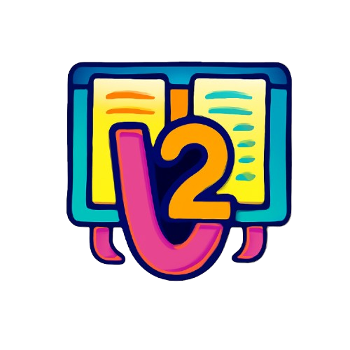

# VersionTwo
Hackathon project: CLI tool to generate static planning view of issues for better team planning

# Problem we are solving
GitHub projects users are unable to easily associate issues across organizations with a project and particularly find having to manually add issues to the project board itself as a time consuming unnecessarily difficult task.

We propose improving this interface by adding a simple HTTP page with an interactive Kanban which is able to aggregate a user provided selection of repos, projects, organizations and display them in a filterable way.

# Getting Started
## Requirements and Setup
The following items are required to run the program.
- Python 3.x
- Python `pyenv` and `pyenv-virtualenv`
  -  `brew install pyenv pyenv-virtualenv`
- GitHub Command Line Interface (CLI) `gh`
- Authentication through `gh auth login`
  - Set the appropriate token permissions: `gh auth refresh --scopes read:project`

Run `make install` inside the repo directory to configure the appropriate versions of dependencies.

# How does it work?

```mermaid
%% A · System-Architecture Diagram (≤25 nodes)
flowchart TD
    A[CLI Invocation] --> B{version2config.py<br/>Parse flags & env}
    B --> C[Validated Config]
    C --> D{version2query.py<br/>Token check}
    D --> E[GraphQL call projectsV2]:::api
    E --> F[gh project item-list]:::cli
    F --> G[items *.json]
    G --> H[Consolidate to output.items.json]
    H --> I{static_site_generator.py<br/>Jinja2 render}
    I --> J[_site/index.html]
classDef api fill:#e3f2fd,stroke:#2196f3;
classDef cli fill:#f1f8e9,stroke:#7cb342;
