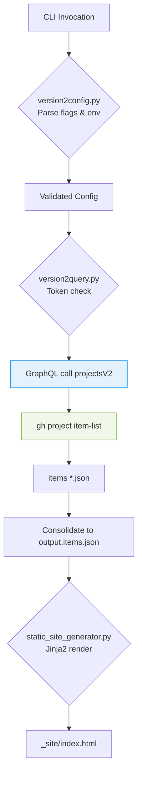

# VersionTwo

Hackathon project: CLI tool to generate static planning view of issues for better team planning

## 🚀 Getting Started

### 📦 Requirements

The following dependencies are required to run the program:

- Python 3.x
  - `brew install python3`
- Python `pyenv` and `pyenv-virtualenv`
  - `brew install pyenv pyenv-virtualenv`
- GitHub Command Line Interface (CLI) `gh`
  - `brew install gh`

### 💻 Setup

- Authentication through `gh auth login`
- Source the [setup-gh.sh](src/setup-gh.sh) script to configure your gh environment variables
  
  ```bash
    source src/setup-gh.sh # follow the prompts
  ```

  - Sets the appropriate token scopes: `read: project`.
    - Note: The team must have `read` permissions on the Project Board in order to view the issues on the board.
  - Sets the `GITHUB_TOKEN` environment variable.
  - Sets the `GITHUB_UNAME` environment variable.
- Run `make install` inside the repo directory to configure the appropriate versions of dependencies.

### 🛠 Usage

To run the main script, change to the current directory of the script, then run:

`python version2.py --output-file "<filename.json>" --temp-dir "<temp.dir>" --include-project <project name>`

See the `--help` menu for full list of filter functionality.

## Background

GitHub users have issues assigned to themselves or a team they are a member of. These issues can be viewed on a 
Project board, which captures the issues in swim lanes. The Project board can only automate with a single organization,
meaning users who work in more than one org do not have a single location to view all issues. This leads to fragmented
planning and execution.

## How does it work?



## Our Solution

Our python script will query the GitHub API for all issues associated with the appropriate filters provided to the CLI
tool. The output will be a static HTML page showing all issues in swim lanes. This provides a comprehensive overview
of all issues the team or user has assigned.
